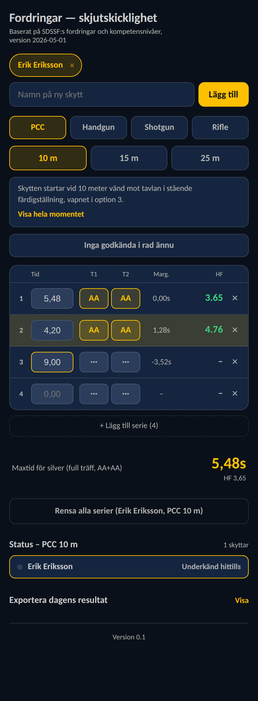

[README.md](https://github.com/user-attachments/files/32302824/README.md)
# Fordringar — skjutskicklighet

Ett digitalt poängkort för IPSC-fordringarna (PCC, Handgun, Shotgun, Rifle). Istället för att räkna hitfactor för hand mot ett Excel-ark på skjutbanan, matar du bara in tid och träffar direkt i telefonen:

- Räknar hitfactor live och visar om du klarar silver, guld eller elit
- Visar marginalen till maxtiden för silver medan du skjuter
- Håller koll på flera skyttar samtidigt, var och en med sina egna serier per gren och avstånd
- Bygger en sammanfattning i slutet av dagen — vem som klarat vad — klar att kopiera eller maila
- Möjlighet att ansluta SG- eller PIE timer för att mata in tiden automatiskt.

## Installera på din telefon

Appen är en **PWA** (progressive web app) — den installeras direkt från webbläsaren, utan App Store eller Google Play.

### iPhone (Safari)

[Länk till sidan](http://clab252.github.io/ipscfordringar)
1. Öppna sidans länk i **Safari** (måste vara Safari, andra webbläsare på iPhone stöder inte det här).
2. Tryck på dela-ikonen (fyrkanten med pilen uppåt) längst ner i mitten.
3. Skrolla ner i menyn och välj **"Lägg till på hemskärmen"**.
4. Tryck **"Lägg till"** uppe i högra hörnet.
5. En app-ikon dyker upp på hemskärmen — öppna appen därifrån som vilken app som helst.

### Android (Chrome)
[Länk till sidan](http://clab252.github.io/ipscfordringar)
1. Öppna sidans länk i **Chrome**.
2. Tryck på menyn (⋮) uppe i högra hörnet.
3. Välj **"Lägg till på startskärmen"** eller **"Installera app"** (texten skiljer sig lite mellan Chrome-versioner).
4. Bekräfta genom att trycka **"Lägg till"** / **"Installera"**.
5. Appen dyker upp på startskärmen och i appmenyn.

När appen väl är installerad fungerar den offline och sparar allt du matar in lokalt på just den telefonen.

---
